# Projetos Figma

## Sobre

Este repositório reúne projetos desenvolvidos durante meus estudos e práticas de UI/UX Design utilizando o Figma.

Os projetos foram criados como exercícios de aprendizagem, com foco na prática de conceitos de design de interfaces, organização visual, prototipação e estruturação de diferentes tipos de telas e experiências digitais.

## Projetos

### Projeto 01

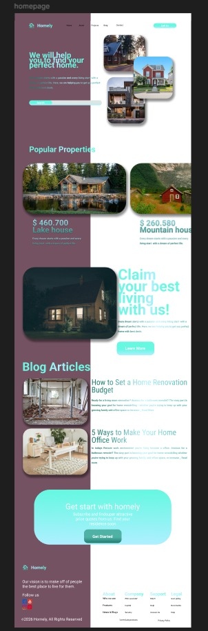

---

### Projeto 02

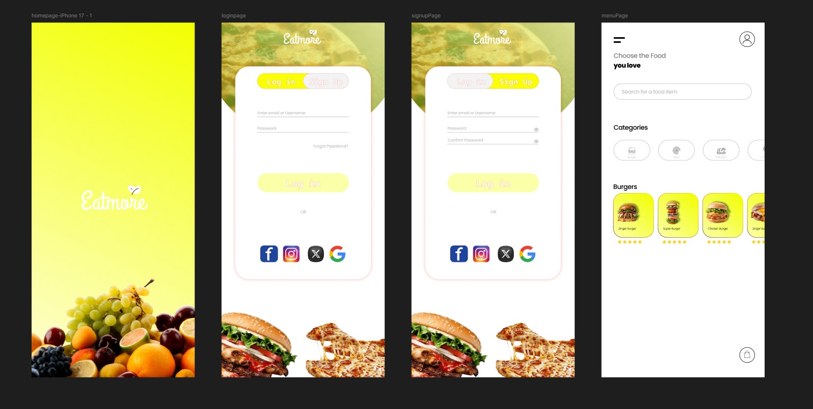

---

### Projeto 03

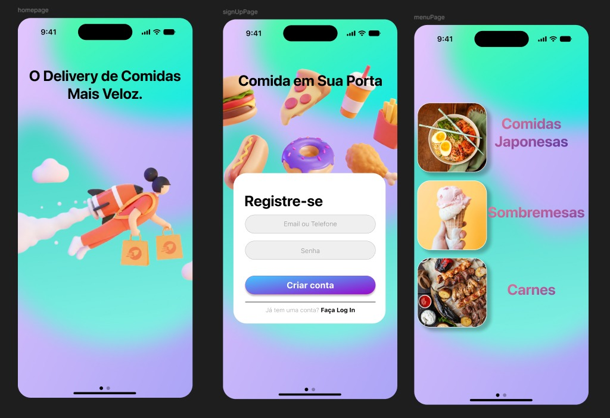

---

### Projeto 04

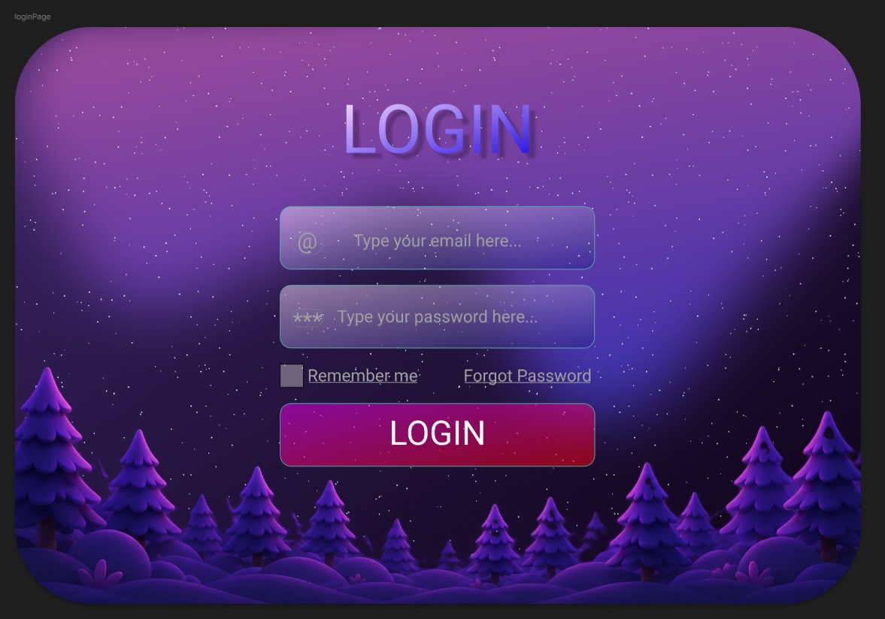

---

### Projeto 05

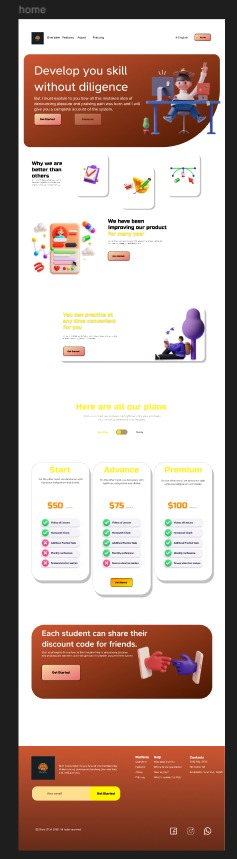

---

### Projeto 06

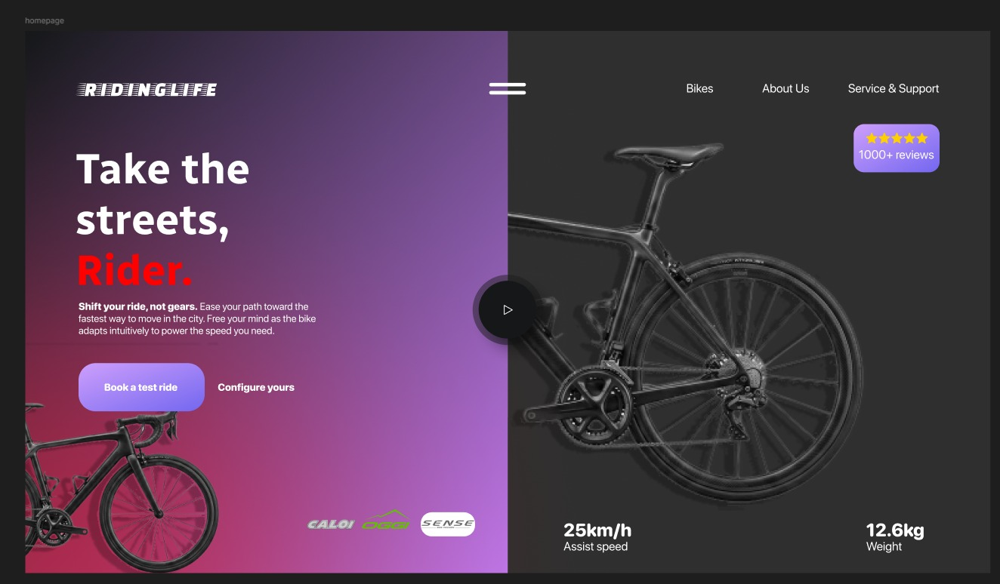

---

### Projeto 07

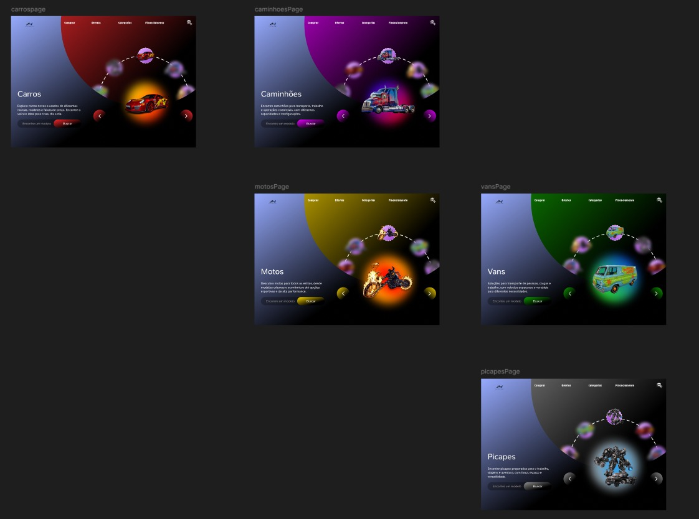

---

### Projeto 08

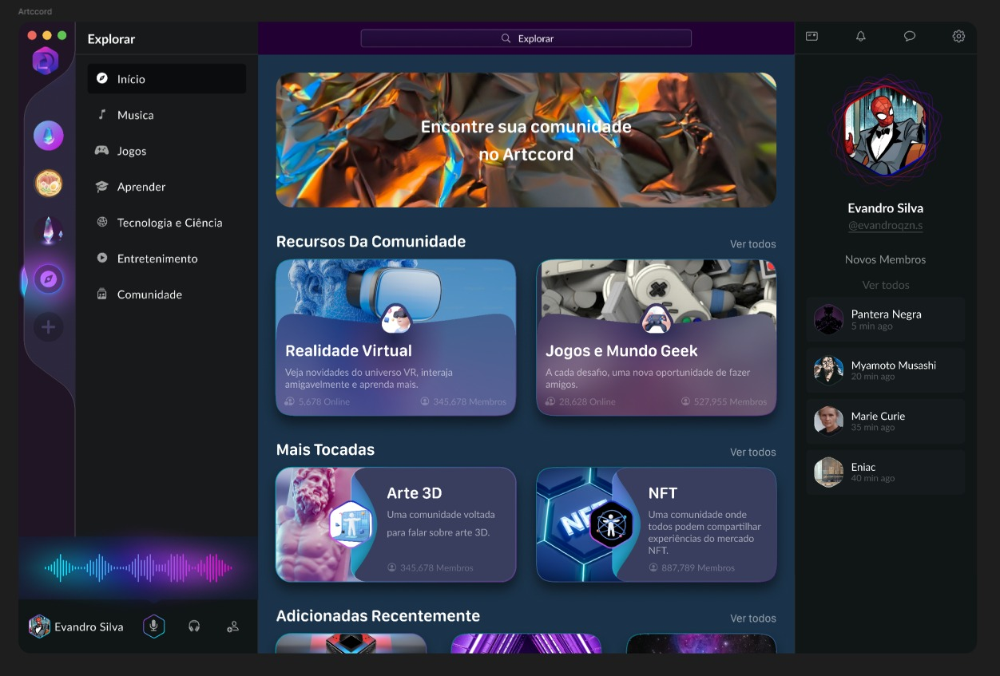

---

### Projeto 09

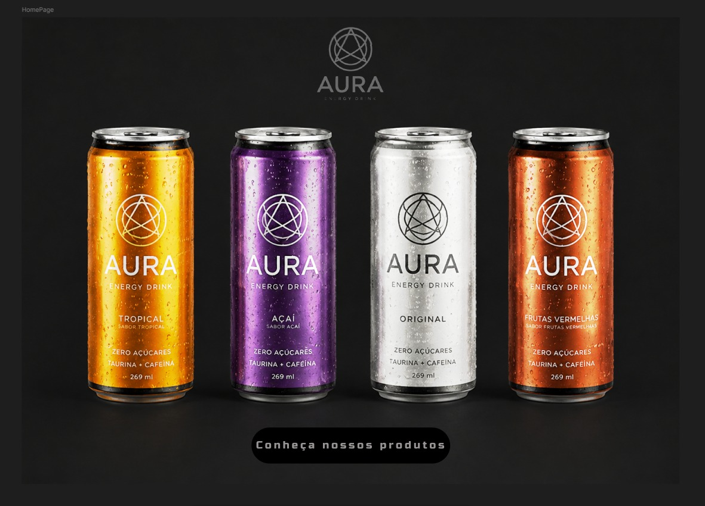

---

### Projeto 10

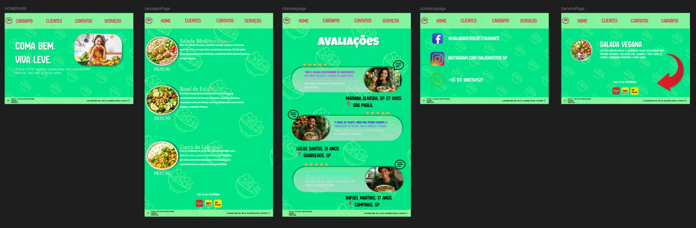

---

### Projeto 11

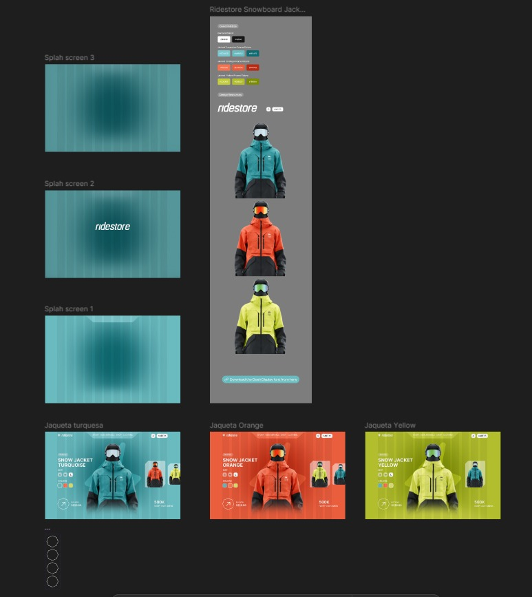

## Objetivo

O objetivo deste repositório é documentar minha prática e evolução no desenvolvimento de interfaces digitais, reunindo projetos realizados como exercícios e estudos no Figma.

## Ferramenta

- Figma

## Observação

Os projetos apresentados neste repositório foram desenvolvidos para fins de estudo e aprendizagem. Portanto, não representam necessariamente produtos ou soluções comerciais.